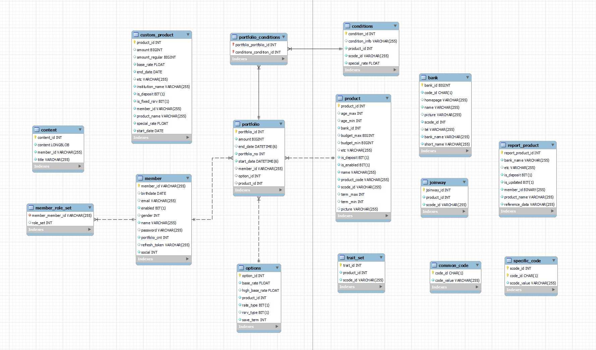

# Queant, 나만의 예금&적금 포트폴리오 만들기

- 삼성 청년 SW아카데미 공통프로젝트 우수상
- 2022년 7월 6일 ~ 2022년 8월 19일


## 📋목차

1️⃣ <a href='1%EF%B8%8F⃣-개요'>개요</a> <br>
2️⃣ 프로젝트 구성원 & 기여도 <br>
3️⃣ 개발 환경 & 설계 <br>
4️⃣ 시연 <br>
5️⃣ 문제 & 해결

<br>

## 1️⃣ 개요
> 퀸트(Queant)는 여왕개미(Queen + Ant)의 약자입니다.
보통 개인 투자자를 개미라고 부르는데, 안전한 자산 관리로 여왕개미가 되자는 의미입니다.
> 
> 
> 최근 금리가 오르며 예금, 적금 상품의 인기가 함께 오르고 있습니다.
> 퀸트는 국내 은행의 예금, 적금 상품 정보를 제공하고, 사용자가 선택한 조건에 일치하는 상품을 가상의 포트폴리오에 담아 간편하게 비교할 수 있는 서비스를 제공합니다.
> 


<br>

## 2️⃣ 프로젝트 구성원 & 기여도

### 🔸 프로젝트 구성원


<br>

### 🔸 기여도 (Front-End)

- 설계
    - Figma 디자인
    - Components & Routes 구조 설계
- 개발
    - Axios 통신 & Store 관리
        - Login & Register
        - Admin
        - Banks
        - Products
        - Profile
        - My Portfolio
    - 디자인
        - Navigation Bar
        - Login & Register
        - Admin
        - Products Results
        - My Portfolio

<br>

## 3️⃣ 개발 환경 & 설계

### 🔸 아키텍처


<br>

### 🔸 기술 스택

<details>
  <summary><h4>Front-End</h4></summary>
  <li>Visual Studio Code 1.70.0</li>
  <li>Vue3</li>
  <li>Node.js 16.16.0</li>
  <li>npm 8.11.0</li>
  <li>vuex 4.0.2</li>
  <li>vue-router 4.0.13</li>
</details>

<details>
  <summary><h4>Back-End(Spring Boot)</h4></summary>
  <li>IntelliJ</li>
  <li>Spring boot 2.6.7</li>
  <li>Spring-boot-jpa</li>
  <li>Spring Security</li>
  <li>Java 8</li>
  <li>Junit 4.13.1</li>
  <li>Mysql connector java 8.0.29</li>
  <li>Json Web Token 0.11.2</li>
  <li>Spring Fox BootStarter 3.0.0</li>
  <li>Jsoup 1.14.3</li>
  <li>ModelMapper 2.4.2</li>
  <li>Spring Cloud Starter AWS 2.2.6</li>
</details>

<details>
  <summary><h4>Back-End(Django)</h4></summary>
  <li>Python 3.10.5</li>
  <li>Django-apscheduler 0.6.2</li>
  <li>PyMySQL 1.0.2</li>
  <li>Bs4 0.0.1</li>
  <li>Gunicorn 19.6.0</li>
  <li>Lxml 4.9.1</li>
</details>

<details>
  <summary><h4>CI/CD</h4></summary>
  <li>AWS EC2</li>
  <li>MariaDB</li>
  <li>Docker</li>
  <li>Nginx</li>
  <li>Jenkins</li>
</details>

<br>

### 🔸 설계

#### 와이어프레임


#### ERD



<br>

## 4️⃣ 시연

### 🔸 UCC

[](https://youtu.be/-WiFoY4lNRk) 

<br>

### 🔸 메인 서비스 시연

#### 상품 검색 & 장바구니 & 가상 포트폴리오

[](https://youtu.be/rMqM7qSuPM0) 

#### MY 포트폴리오
[](https://youtu.be/rhvItLLQlbU) 

<br>

## 5️⃣ 문제 & 해결

<details>
  <summary><h3>소셜 로그인 - Back-End와 통신하며 응답 받을 시점?</h3></summary>

- **문제**

> 소셜 로그인을 구현하기 위해 처음에 세운 전략은 다음과 같다. 
Front End와 Back End에서 API KEY를 이중으로 관리하기 보단 하나의 API KEY를 이용하고자 소셜 로그인을 위한 모든 로직을 Back End에 작성하고, Front End는 Back End에 단 한 번의 요청으로 소셜 로그인 주소를 Redirect 받고, Token을 발급 받는다. 

1. 소셜 로그인 버튼 클릭
2. 소셜 로그인 화면으로 Redirect
3. 소셜 로그인 성공
4. 화면에 Token값 출력
 
1요청 1응답을 준수하지 않아서 문제가 발생했다. Front End는 Back End에게 소셜 로그인 화면을 요청하고, 그에 대한 응답을 받으면 끝난다. 뒤이은 Token값에 접근할 방법이 없다.
 
<br>
 
- **해결**

> 로그인 화면을 띄워서 인가 코드(Authorization Code) 발급 요청과 인가 코드로 Token값을 받는 총 2번의 요청을 보낸다.

1. 인가 코드를 받아 백엔드에게 두 번째 요청을 보내기 위해 route를 가진 컴포넌트를 생성
2. 소셜 로그인 플랫폼(Resource Server) Redirect URI에 위 주소를 추가

Front End에서 소셜 로그인 버튼을 클릭했을 때 Back End 로직에 의해 소셜 로그인 화면이 띄어지고, 사용자가 소셜 로그인에 성공하면 Redirect URI의 Query로 인가 코드에 접근할 수 있다. Back End에 인가 코드를 담아 요청하면 작성된 로직에 의해 소셜 로그인 플랫폼에 Token값을 응답 받는다.
> 

```jsx
// 1. 로그인 화면에서 구글 로고를 클릭하면 구글 로그인 화면으로 이동한다.
googleLogin() {
  axios({
    url: spring.social.google(),
    method: 'get'
  })
  .then((res) => {
    window.location.href = res.data
  })
  .catch((err) => {
    console.log(err)
  })
},

// 2. 구글 로그인에 성공하면 redirect URI주소('vue.localhost/google' == GoogleView.vue)의 route.query에 담긴 인가코드를 백엔드에게 다시 요청보낸다. 
getGoogleAuthorizationCode({ dispatch }, authorizationCode) {
  axios({
    url: spring.social.googlelogin(),
    method: 'get',
    params: {
      code: authorizationCode
    }
  })
  .then((res) => {
    dispatch('saveAccessToken', res.data.AccessToken)
    dispatch('saveRefreshToken', res.data.RefreshToken)
    dispatch('fetchUserInfo', res.data.email)
    router.push({ name: 'home' })
  })
  .catch((err) => {
    if (err.response.status === 409)
      alert('Queant 또는 다른 소셜 계정으로 이미 가입된 계정입니다.')
    else if (err.response.status === 423) {
      alert('비활성화 계정입니다.')
	    router.push({ name: 'login' })
		}
  })
},
```
</details>

<details>
  <summary><h3>실시간 이중 필터링 처리</h3></summary>

- **문제**

> Admin 권한을 지닌 유저는 관리자 페이지에서 전체 가입 유저를 조회하고, 유저의 권한 및 계정 활성화 여부를 조정할 수 있다. 보다 편리하고 효율적으로 조회하기 위해 유저를 권한(User, Manager, Admin), 가입 유형(Google, Naver, Kakao, None)별로 필터링해서 조회하는 기능을 넣고자 했다. 처음 전략은 전체 유저를 store에 배열 users로 관리하고, 권한으로 유저 조회하는 API를 요청해서 받은 응답에서 users와 겹치는 데이터들로 users를 갱신하고, 가입 유형으로 유저 조회하는 API 요청도 마찬가지로 구상했다.

처음엔 얼추 기능하는 것처럼 보이지만, 필터를 여러 번 바꿔보니 수시로 갱신 되는 users가 꼬여서 필터링이 제대로 되지 않았다.
> 

<br>

- **해결**

> 실시간 이중 필터링 처리를 위해 총 5가지의 state를 생성, 관리하기로 했다. 처음 전체 유저를 저장하는 users, 권한 필터링이 적용된 유저를 저장하는 roleUsers, 가입 유형 필터링 적용된 유저를 저장하는 socialUsers. 그리고 어느 필터링이 적용된 상태인지 확인하는 roleStatus, socialStatus. 흐름은 아래와 같다.

1. 컴포넌트가 화면에 출력되면 전체 유저 정보를 응답 받아 users에 저장 & 출력
2. Admin 유저 필터를 걸면 roleStatus에 Admin 저장
3. Admin 유저 정보를 응답 받아 roleUsers에 저장 & 출력
4. 위 결과에서 Kakao로 가입한 유저를 조회하기 위해 추가로 필터를 걸면 socialStatus에 Kakao 저장
5. Kakao로 가입한 유저 정보를 응답 받아 socialUsers에 저장
6. 현재 roleStatus의 값으로 권한 필터를 확인하고, 이중 반복문으로 roleUsers와 socialUsers를 순회하여 id가 일치하는 유저 정보만 새로운 배열에 담아 출력
7. 반대의 경우도 로직이 동일하기 때문에 실시간으로 필터를 수정해도 제대로 동작한다.
> 

😅 *이후 API 개선으로 로직이 간단해졌다.*
</details>

<details>
  <summary><h3>비동기 처리가 항상 옳은 것일까?</h3></summary>

- **문제**

> 어드민 유저는 관리자 페이지에서 모든 유저 정보를 조회할 수 있고, 유저의 권한, 계정 활성화 여부를 조정할 수 있다. 이 작업을 비동기로 처리 하려는 중 문제가 발생했다.

상위 컴포넌트에서 전체 유저 정보를 v-for로 순회하며 하위 컴포넌트에 각 유저 정보를 props로 하달 했고, 하위 컴포넌트에서 props로 받은 data를 store의 state와 getters에 저장하여 이용하려 했으나, v-for의 마지막 요소만 저장되어 모든 하위 컴포넌트가 동일한 유저 정보를 출력하게 됐다.
> 

<br>

- **해결**

> 단일 route로 관리되는 컴포넌트를 한 화면에 출력하면서 공용으로 쓰이는 store에서 각각의 유저 정보를 관리하려고 했기 때문에 발생한 문제였다. 이를 해결하기 위해서 떠오른 방법은 동적 path route 구조를 설계하여 유저마다 고유 path route를 갖도록 한다.

그 전에 근본적인 원리를 생각해봤다. 일반적으로 어드민 유저는 한 명이 아니라 여러 명이라 한 번에 여러 작업이 이루어질 수 있다. 비동기 처리는 사용자 경험 증진이 주 목적이라고 생각하는데, 관리자 페이지처럼 동시 다발적으로 이루어질 수 있는 중요한 작업은 변경 사항이 있을 때마다 동기 처리해주는 것이 취지에 적합하다고 판단되어 동기 처리로 결정했다.
> 


</details>

<details>
  <summary><h3>v-for의 배열 요소를 read뿐 아니라 write하는 방법</h3></summary>

- **문제**

> v-for를 이용해서 table을 작성할 때, 요소가 지닌 속성-값을 변경하려면 어떻게 해야 할지 고민이 됐다. v-for의 요소를 v-model로 매핑하는 것은 불가능했고, 하위 컴포넌트를 생성해서 요소를 props로 내려 받는 방법도 있지만, 화면에 table의 head가 요소의 개수만큼 표시되어서 보기 좋지 않았다.
> 

```html
<table class="rwd-table">

	...

    <tr v-for="customProduct in customProducts" :key="customProduct">

			...
	
      <td>
        <p>{{ customProduct.name }}</p>
      </td>
      <td>
        <p>{{ customProduct.start_date }} ~ {{ customProduct.end_date }}</p>
      </td>

			...

    </tr>

	...

</table>
```

<br>

- **해결**

> 모달로 해결했다. v-for가 도는 scope안에 button을 생성해서, 모달 띄우는 메소드를 연결했다. button을 누르면 customProduct를 modal 컴포넌트에 props로 내려 받는 방법으로 깔끔한 UI를 구현했다.
> 

```html
	...

		<td>
		  <button @click="openCustomProductEditModal(customProdcut)">
		    수정
		  </button>
		</td>

	...
```


</details>
